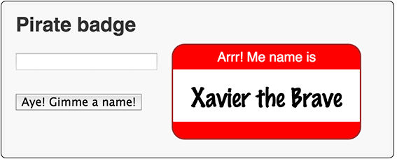

# 步骤 5：保存到本地存储

在这一步中，你给应用一些持久性通过把标记的名字保存到本地存储当它每次改变时。当你重启应用时它初始化标记，从保存的名字里。

## 编辑 piratebadge.dart 

从 `dart:convert` 库里导入 JSON 转化器。

```
import 'dart:html';
import 'dart:math' show Random;
import 'dart:convert' show JSON;
```

## 关键信息

- `JSON` 提供了方便的访问最常见的 JSON 的用例。  

---

给 PirateName 类添加一个命名的构造函数。

```
class PirateName {
  ...
  PirateName.fromJSON(String jsonString) {
    Map storedName = JSON.decode(jsonString);
    _firstName = storedName['f'];
    _appellation = storedName['a'];
  }
}
```  

- 构造函数创建一个新的 PirateName 实例来自 JSON 编码的字符串。
- `PirateName.fromJSON` 是一个命名的构造函数。  
- `JSON.decode()` 解析 JSON 字符串并由此创建一个 Dart 对象。
- `pirate name` 解析成一个 `Map` 对象。    

--- 

添加 getter 给 PirateName 类，编码 pirate name 在 JSON 字符串中。

```
class PirateName {
  ...
  String get jsonString => JSON.encode({"f": _firstName, "a": _appellation});
}
```  

- getter 使用 map 格式化 JSON 字符串。  

---

声明一个顶级字符串。 

```
final String TREASURE_KEY = 'pirateName';

void main() {
  ...
}
```

- 你保存键值对到本地存储，这个字符串是键，` pirate name` 是值。   
 
---

当标记的名字更改时保存标记的 `pirate name` 。

```
void setBadgeName(PirateName newName) {
  if (newName == null) {
    return;
  }
  querySelector('#badgeName').text = newName.pirateName;
  window.localStorage[TREASURE_KEY] = newName.jsonString;
}
```

- 本地存储通过浏览器窗口提供。   
 
---

添加一个顶级函数 `getBadgeNameFromStorage()` 。

```
void setBadgeName(PirateName newName) {
  ...
}

PirateName getBadgeNameFromStorage() {
  String storedName = window.localStorage[TREASURE_KEY];
  if (storedName != null) {
    return new PirateName.fromJSON(storedName);
  } else {
    return null;
  }
}
```

- 这个方法从本地存储检索 `pirate name`并且由此创建一个 PirateName 对象。  

---

通过 `main()` 函数调用方法。

```
void main() {
  ...
  setBadgeName(getBadgeNameFromStorage());
}
```

- 从本地存储中初始化标记的名字。  

---

## 运行应用

通过 `File > Save All` 保存文件。

运行应用通过正确点击 `piratebadge.html`，选择 `Run in Dartium`。

把你的应用和下面正在运行的进行比较。

点击放一个名字进标记。重新运行这个应用会看到你写的名字。


 
